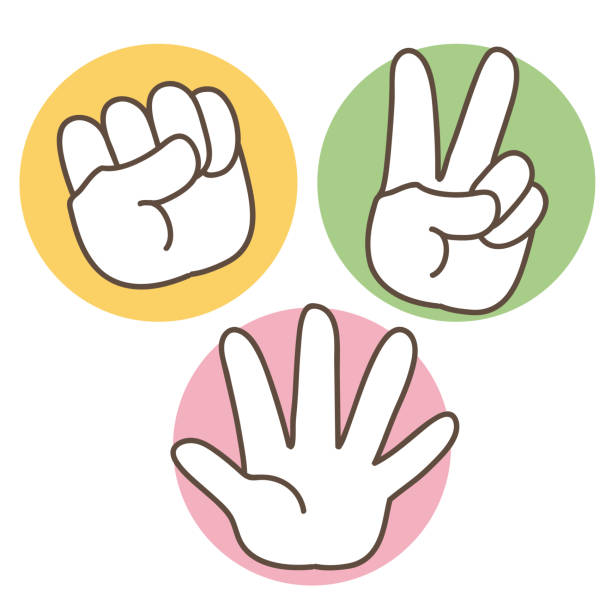

# Piedra Papel o Tijera ! 
* El proyecto se basa en recrear el juego piedra papel o tijera 
* para ello se despliegan las imagenes en la pantalla (a modo de menu), donde el usuario debe hacer click en una de ellas para seleccionar su opcion deseada 
* Se generara de manera aleatoria la opcion de la computadora, y basandose en las reglas basicas del piedra papel o tijera, se definira un ganador 
* El juego se desarrolla al mejor de 5 rondas, es decir, si uno alcanza las 3 victorias se da por finalizado el juego y se declara el ganador 
* Las rondas que terminen en no suman puntos para ninguna de las partes, y si se llega a la ronda 5 sin que ninguno de los adversarios llegue a las 3 victorias, se evalua el que mayor numero de victorias que tenga cada uno y se declarara el ganador del juego, o en su defecto, el empate 

## Manual de uso
1. Vista general de la pagina

    
    

2. Inicio

El primer paso, es dirigirse al boton que indica comenzar a jugar y darle un click

La pagina pedira ingresar un nombre, que debera ser distinto de vacio

    

Una vez ingresado un nombre valido, la interfaz cambiara, pasando a mostrar la verdadera apariencia del juego que es la siguiente 

 

3. Conociendo la interfaz 

Como se puede observar, existen 3 zonas delimitadas
+ zona del jugador: de fondo azul, aqui se visualizan tanto el nombre del jugador, las opciones disponibles a elegir y la cantidad de victorias que lleva
+ zona de informacion: de fondo gris, aqui se muestra una breve instruccion para comenzar a jugar, el numero de ronda y en el futuro, se podran visualizar los resultados tanto de las rondas, como del juego en general
+ zona de la computadora: de fondo rojo, al igual que la zona del jugador se muestran los mismos campos

Y por ultimo, en la parte inferior izquierda, se situa un boton con el cual podemos reiniciar el juego

4. Demostracion del juego

Siguiendo las instrucciones, el jugador "selecciona" una de las opciones, haciendo click sobre ella, en este ejemplo se elegira tijera

Una vez seleccionada la opcion, automaticamente se elige la opcion de la computadora, y se obtiene el resultado de la ronda

 
    

Solo quedaran visibles, las opciones seleccionadas por ambos, ademas de incrementar los contadores de victorias correspondientes, o ninguno en caso de empate

El siguiente paso es avanzar a la siguiente ronda, una vez selecciona esa opcion, la interfaz volvera a la apariencia mostrada en el punto 2

5. Resultado final

En esta prueba la computadora resulto victoriosa en tan solo 4 rondas, como se muestra a continuacion

Una vez finalizado el juego, se muestra el resultado de la ultima ronda y del juego en general. Si se desea volver a jugar, simplemente se hace click sobre el boton de reiniciar y se vuelve al inicio

    